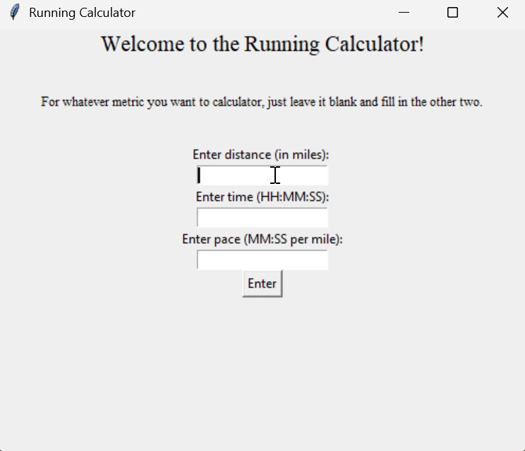

# Running Calculator

A simple Python GUI application built with Tkinter that calculates distance, time, or pace based on any two inputs. It’s perfect for runners who want a quick and easy way to determine how far they’ve run, 
how long a run will take, or what pace they’re maintaining. To use the app, simply enter any two of the following: distance (in miles), time (HH:MM:SS), or pace (MM:SS per mile). 
The app will instantly calculate and display the missing value using a clean and responsive Tkinter interface.


---
##  Demo


---

## How to run / Use yourself

1. **Clone the repository and navigate to folder**:
   ```bash
   git clone https://github.com/JackHatlestad/Running_calculator.git
   cd Running_Calculator
2. **Run Program**:
   ```bash
   Python Calculator.py
   
